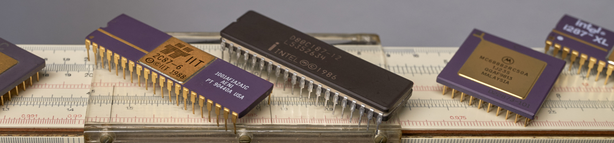
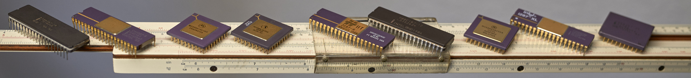

# IIT 2C87 / Intel 80C187 Numeric Data Processor Interface

### Peripheral interface for the Raspberry Pi Pico 2 (RP2350) and similar microcontrollers

> ⚠️ This project is intended for **educational and historical purposes**.  
> The IIT 2C87 and Intel 80C187 are **obsolete components** and are
> **not recommended for new designs (NRND)**.

## Overview

This project demonstrates how to interface the **IIT 2C87 and Intel 80C187 numeric data processors (NDP)** as peripheral devices with a wide range of microprocessor and microcontroller systems. It serves as a direct follow-up to the [mc68881_pico2](https://github.com/thorstenschob/mc68881_pico2) project, implementing equivalent test routines for common floating-point operations

While early x87 NDPs relied on tightly coupled architectures, this project focuses on the later, more flexible, peripheral-style interfaces, bridging these NDPs to systems like the Raspberry Pi Pico 2 (RP2350) or other microprocessors.

## Key Features

- **Full IEEE-754 (1985) Compliance:** True hardware-level floating-point arithmetic.
- **16-Bit Peripheral Interface:** Emulated bus communication for flexible CPU bus integration.
- **High-Efficiency Math Pipelines:** Leverages unique 2C87/C187 architectural optimizations.

>-  **Tested & Verified:** IIT 2C87, Intel 80C187, i287**XL**, 80287XL, 80C287, 80287

---

.


## Description 

The **IIT 2C87** and the late **Intel 80C187** represent the peak of 16-bit coprocessor design for Intel microprocessors, ensuring strict compliance with **IEEE Standard 754-1985**. Unlike earlier, non-compliant 8087 and 80287 chips, these later designs addressed previous architectural limitations:

* **IIT 2C87:** Provided a full IEEE-754 compatible core with integrated trigonometric functions, accelerated matrix and vector operations, all drop-in compatible with a standard 40-pin 287 socket.
* **Intel 80C187:** Engineered as a dedicated I/O-mapped numeric coprocessor specifically for the Intel 80C186XL, featuring a processor-oriented peripheral interface rather than the traditional tightly coupled x87 bus architecture

---


## Historical Context: The Evolution of x87 Floating-Point and Trigonometric Hardware


To understand the technological significance of the **IIT 2C87**, Intel **80C187**, Intel **287XL**, and Motorola **MC68881/MC68882**, it is useful to examine the evolution of floating-point coprocessors during the 1980s. These devices gradually bridged the gap between pre-standard floating-point behavior and full IEEE 754-1985 compliance, while also introducing comprehensive hardware support for transcendental and trigonometric functions that had previously required software libraries or approximations.


* **Intel 80287 (1982) & The Asynchronous Bottleneck:**  
  The original 80287 was inherently flawed compared to Motorola's orthogonal peripheral design. Even when paired with a fast 80286 CPU, the 80287 ran asynchronously—often clocked at only 2/3 of the CPU's frequency. Furthermore, it still retained the early, pre-standard quirks of the original 8087.

* **MC68881 (1985) and MC68882 (1987):**  
  These chips were among the first coprocessors to fully implement the IEEE 754-1985 floating-point standard in hardware. Because they could operate as either memory-mapped or peripheral-mapped coprocessors, they were exceptionally well-suited for external hardware interfacing.

* **IIT 2C87 / 3C87 (Integrated Information Technology, 1989):**
  A highly regarded CMOS-compatible implementation that significantly outperformed contemporary Intel 80287 devices in many workloads. IIT engineered their chips with a dedicated hardware matrix multiplier and **additional internal registers**. This allowed the IIT 2C87 to execute 4 x 4 matrix transformations in a fraction of the clock cycles required by a standard Intel 287, making it highly prized for early 3D rendering and CAD workstations.

* **Intel 287XL (1990) – The Intel 387-Core Upgrade:**  
  Introduced late in the lifecycle, the 287XL replaced the aging 80287 silicon with an optimized **80387 execution core**. This upgrade brought full IEEE 754-1985 compliance and a massive performance boost to legacy 80286 platforms using a standard 287 socket.

* **Intel 80C187 (1989/1990) – A Unique Peripheral NDP**
  The 80C187 occupies a special place within the x87 family. Designed specifically for Intel's embedded-oriented 80C186XL processor, it combined a bus-oriented peripheral interface with an internal execution engine derived from later x87 technology offering uncompromised IEEE 754-1985 compliance at the hardware level.

## Implementation Basis & Reference Design

To minimize documentation overhead and maintain compatibility with the original [mc68881_pico2](https://github.com/thorstenschob/mc68881_pico2) repository, this implementation mirrors the structure of its primary test suite. 

The software architecture and hardware interfaces map directly to the original datasheets. Developers seeking exhaustive, byte-level specifications should consult these datasheets as the definitive reference.

## Functional Verification & Application

Three sequential software tasks are used to validate the physical bus connection, state machine timing, and system initialization sequence:

#### Structural & Connection Tests

Before transmitting complex mathematical arrays across the bus, the integrity of the basic control lines is verified using deterministic register operations.

#### On-Chip Constant Calculations

Once data bus exchange stabilizes, the system executes native coprocessor instructions to read embedded mathematical constants directly from the chip's internal ROM. 

Reading and writing these values across 32-bit single-precision and 80-bit packed BCD formats confirms precise bus timing synchronization.

*Note (WIP): Verification of numerical data transfers across all formats is currently in progress, with a specific focus on resolving endianness differences between the two architectures.*

#### Mandelbrot Fractal Calculation
As the definitive test of the combined architectural concept, the main processor offloads the entire calculation of a **Mandelbrot fractal** directly to the coprocessor.

The implementation detailed in Werner Durandi’s proposal for the Intel 8087 (*c't 1987-3 p. 88*, pp. 84–89) demonstrates that a well-designed register allocation scheme can entirely relieve the processor of time-consuming arithmetic calculations. Microprocessor interaction is minimized to simply retrieving the results of comparison operations within the calculation loops.

The following sample demonstrates the algorithm using values optimized for manual verification.. (;- )

---

##### Terminal Output & Test Execution

A short preview of the register configurations and test execution output on the RP2350 (Pico 2):

```text
Iteration nach Werner Durandi (c't 3/87) - DEBUG PRINT  TEST   n=FCOMP C-code 

loop ix, jy   3, 2

NDP register R0    R1     R2     R3     R4     R5     R6     R7 
...
FLD_1   :   3.0;   2.0;   3.0;   7.0;   nan;   nan;   nan;   nan; 
            x      cy     cx     r   
FLD_1   :   2.0;   3.0;   2.0;   3.0;   7.0;   nan;   nan;   nan; 
            y      x      cy     cx     r   
FMUL_0  :   4.0;   3.0;   2.0;   3.0;   7.0;   nan;   nan;   nan; 
            y²     x      cy     cx     r 
... 
... // ascii art mandelbrot drawing//..

```

> 📄 **Full Log Available:** You can view the complete, unabridged log file in the repository at [`docs/C187_Pico2_Terminal_output.txt`](docs/C187_Pico2_Terminal_output.txt).

### Source Data & Header Generation

The definitions in `NDP_x87.h` were extracted directly from the official 80C187 datasheet, processed via a spreadsheet, and reformatted for this project. The structural organization and instruction order mirror the original hardware documentation exactly.


---
*Note (WIP & todo):  Verification of numerical data transfers across all formats is currently a work in progress,
.
.
.
## References & Resources

This project is built upon the following documentation, specifications, and articles:

### Primary Documentation & Datasheets
> **Intel 80C187 (1992):** *DS 80C187 80-Bit Math Coprocessor, November 1992 Order Number:_270640-004*


.

.

---

### Further Reading & Context

##### NDP 80x87 Insights
> **IEEE Wiki:**  [Milestone-Proposal:Intel 8087 Math Coprocessor](https://ieeemilestones.ethw.org/Milestone-Proposal:Intel_8087_Math_Coprocessor)
> - *A comprehensive historical assessment.*

* **Wikipedia:** [Intel 8087](https://en.wikipedia.org/wiki/Intel_8087) – *Detailed background on the architecture that started the x87 line.*
* **Intel Corporation (Datasheet):** [Intel 80C187 80-Bit Math Coprocessor](https://www.cpu-galaxy.at/CPU/Intel%20CPU/Coprozessor/Intel%2080187%20Section-Dateien/Intel_80C187_Datasheet.pdf) – *Copy of official hardware specifications.*

* **Lecture, side note:** [Mathematics written in sand](https://people.eecs.berkeley.edu/~wkahan/MathSand.pdf) - * A nice comparison with UPN calculators and their properties.*

##### Mathematical & Engineering Foundations
* **NASA JPL (2016):** [How Many Decimals of Pi Do We Really Need?](https://www.jpl.nasa.gov/edu/news/how-many-decimals-of-pi-do-we-really-need/) – *Insights into precision requirements for space navigation.*

##### Mandelbrot Fractal Calculation
* **Werner Durandi (1987):** *8087-Power verschenkt* (c't 1987, Issue 3, pp. 84–89) – *Provides techniques for optimizing code to fully utilize the Intel 8087 math coprocessor.*
  * *> Note: You can find the archived PDF by searching for `"acpc.me" "8087-Power verschenkt" c't 1987` in online search engines.*

##### Project Media & Visuals
* 📷 **Project Photo Gallery:** [View Physical Implementations & Hardware Progress](https://www.flickr.com/photos/dao-de-leitz/albums/72157718935719288/with/54735085117/)  
  * *> Note: This external gallery is updated periodically to document real-world prototyping steps, and physical wiring.*

.

.

.

---

## License and Acknowledgments

This project is licensed under the **MIT License** - see the [LICENSE](./LICENSE) file for details.

### Third-Party Software
This project utilizes the **Raspberry Pi Pico SDK** (c-sdk) for hardware abstraction and development.
* **Developer:** Raspberry Pi (Trading) Ltd.
* **License:** [BSD-3-Clause](https://opensource.org) (See local copy: [PICO_SDK_LICENSE](./PICO_SDK_LICENSE))
* **Copyright:** Copyright (c) 2020 Raspberry Pi (Trading) Ltd.

---
